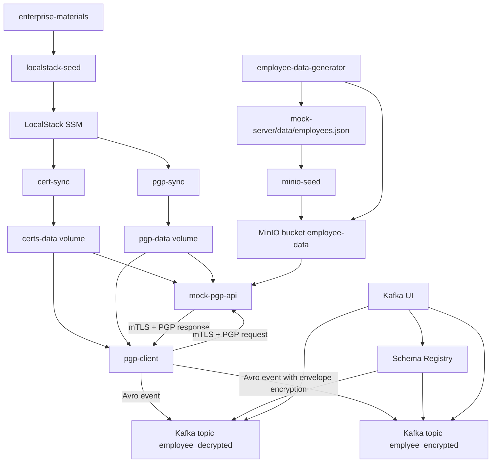

# Runbook

## Purpose

This runbook describes how to operate the PGP REST API demo stack, validate the end-to-end message flow, and monitor Kafka topics and schemas.

## Process Diagram



## Components

- `pgp-client`: Spring Boot + Spark Structured Streaming process that continuously requests employee data and publishes Kafka events.
- `mock-pgp-api`: Flask service that decrypts requests, reads employee data, and returns encrypted responses.
- `kafka`: Single-node Kafka broker.
- `schema-registry`: Confluent Schema Registry for Avro subjects used by the producer.
- `kafka-ui`: Browser UI for topic and schema monitoring.
- `localstack`: Stores PKI and PGP materials in SSM.
- `cert-sync`: Pulls TLS assets from LocalStack into runtime volume.
- `pgp-sync`: Pulls PGP keys from LocalStack into runtime volume.
- `minio`: Object storage used by the mock server.
- `minio-seed`: Uploads employee JSON data into MinIO.
- `employee-data-generator`: Continuously regenerates employee data and uploads the latest file into MinIO.
- `EMPLOYEE_GENERATOR_INTERVAL_SECONDS`: Docker Compose variable controlling generator refresh frequency in seconds.

## Ports

- `8443`: mock PGP API
- `19092`: Kafka external listener
- `8081`: Schema Registry
- `18085`: Kafka UI
- `9000`: MinIO API
- `9001`: MinIO Console
- `4566`: LocalStack

## Startup

1. Initialize local config:

`.env` is ignored by Git. Create it from the tracked template:

```bash
cd /Users/pchen/mygithub/Pgp-RestApi-Spring-Boot
cp .env.example .env
```

1. Start the full stack:

```bash
cd /Users/pchen/mygithub/Pgp-RestApi-Spring-Boot
docker compose up -d --build
```

1. Confirm service status:

```bash
docker compose ps
```

1. Expected steady-state services:

- `kafka` is `Up`
- `schema-registry` is `Up (healthy)`
- `kafka-ui` is `Up`
- `localstack` is `Up (healthy)`
- `minio` is `Up`
- `employee-data-generator` is `Up`
- `mock-pgp-api` is `Up`
- `pgp-client` is `Up`
- seed/sync containers exit successfully

## Functional Validation

1. Check the streaming processor logs:

```bash
docker compose logs --tail=100 pgp-client
```

1. Expected result:

- log lines showing processed streaming events
- Kafka offsets increase on both topics over time

1. Confirm schema subjects were registered:

```bash
curl "http://localhost:8081/subjects"
```

1. Expected subjects:

- `employee_decrypted-value`
- `emplyee_encrypted-value`

## Kafka Operations

### Inspect topics in UI

1. Open Kafka UI:

```bash
open http://localhost:18085
```

1. Verify these topics exist:

- `employee_decrypted`
- `emplyee_encrypted`

### Inspect schema subjects

1. Open Schema Registry:

```bash
open http://localhost:8081
```

1. Or query directly:

```bash
curl "http://localhost:8081/subjects/employee_decrypted-value/versions/latest"
curl "http://localhost:8081/subjects/emplyee_encrypted-value/versions/latest"
```

### Read latest decrypted event

```bash
docker exec kafka /opt/kafka/bin/kafka-get-offsets.sh \
  --bootstrap-server kafka:9092 \
  --topic employee_decrypted
```

Use the latest offset minus 1 with:

```bash
docker exec kafka /opt/kafka/bin/kafka-console-consumer.sh \
  --bootstrap-server kafka:9092 \
  --topic employee_decrypted \
  --partition 0 \
  --offset <OFFSET> \
  --max-messages 1 \
  --timeout-ms 15000
```

### Read latest encrypted event

```bash
docker exec kafka /opt/kafka/bin/kafka-get-offsets.sh \
  --bootstrap-server kafka:9092 \
  --topic emplyee_encrypted
```

Use the latest offset minus 1 with:

```bash
docker exec kafka /opt/kafka/bin/kafka-console-consumer.sh \
  --bootstrap-server kafka:9092 \
  --topic emplyee_encrypted \
  --partition 0 \
  --offset <OFFSET> \
  --max-messages 1 \
  --timeout-ms 15000
```

## Encryption Behavior

### API transport

- Request/response transport between `pgp-client` and `mock-pgp-api` uses `mTLS`.
- Payload exchanged with the mock server uses `PGP` encryption and signature verification.

### Kafka topic `employee_decrypted`

- Stores plaintext employee event payload inside an Avro record.
- Intended for trusted downstream processing.

### Kafka topic `emplyee_encrypted`

- Stores an Avro record whose `payload` is a JSON envelope.
- Envelope encryption behavior:
- A per-message AES-256 data encryption key is generated.
- `employee.ssn` is encrypted with AES-GCM.
- `employee.salary` is encrypted with AES-GCM.
- The data key is encrypted with PGP and stored as `encryptedDataKey`.

## Employee Data Generation

1. Regenerate the source employee dataset manually:

```bash
cd /Users/pchen/mygithub/Pgp-RestApi-Spring-Boot/mock-server
python generate_employees.py --count 200 --start-id 1001 --output data/employees.json --run-once
```

1. Continuous generation in Docker Compose:

```bash
cd /Users/pchen/mygithub/Pgp-RestApi-Spring-Boot
docker compose logs --tail=100 employee-data-generator
```

1. Tune the refresh interval without editing Compose:

Set `EMPLOYEE_GENERATOR_INTERVAL_SECONDS` in `.env`, then restart the service.

```bash
cd /Users/pchen/mygithub/Pgp-RestApi-Spring-Boot
docker compose up -d employee-data-generator
```

1. Reseed by rebuilding the stack or rerunning the seeded services:

```bash
cd /Users/pchen/mygithub/Pgp-RestApi-Spring-Boot
docker compose up -d --build
```

## Common Operations

### Restart the producer only

```bash
cd /Users/pchen/mygithub/Pgp-RestApi-Spring-Boot
docker compose up -d --build pgp-client
```

The `pgp-client` process starts the Spark streaming job automatically on startup.

### Restart Kafka stack components

```bash
cd /Users/pchen/mygithub/Pgp-RestApi-Spring-Boot
docker compose up -d --force-recreate kafka schema-registry kafka-ui pgp-client
```

### View logs

```bash
docker compose logs --tail=200 pgp-client
docker compose logs --tail=200 mock-pgp-api
docker compose logs --tail=200 kafka
docker compose logs --tail=200 schema-registry
```

## Troubleshooting

### API returns HTTP 500

Checks:

- `docker compose logs --tail=200 pgp-client`
- Confirm `schema-registry` is healthy
- Confirm `mock-pgp-api` is up
- Confirm `/shared/certs` and `/shared/pgp` sync containers completed

### Schema Registry unavailable

Checks:

- `docker compose ps schema-registry kafka`
- `curl "http://localhost:8081/subjects"`
- `docker compose logs --tail=200 schema-registry`

Likely actions:

- recreate Kafka and Schema Registry together
- ensure Kafka internal single-node settings are active

### Topics exist but no messages appear

Checks:

- confirm the `pgp-client` streaming job is running
- inspect `pgp-client` logs for serialization or broker errors
- verify offsets with `kafka-get-offsets.sh`
- inspect schemas in Schema Registry

### Kafka UI is up but schemas do not appear

Checks:

- `schema-registry` container is healthy
- Kafka UI env points to `http://schema-registry:8081`
- subjects exist in `curl "http://localhost:8081/subjects"`

## Shutdown

1. Stop the full stack:

```bash
cd /Users/pchen/mygithub/Pgp-RestApi-Spring-Boot
docker compose down
```

1. Stop and remove volumes as well:

```bash
cd /Users/pchen/mygithub/Pgp-RestApi-Spring-Boot
docker compose down -v
```

Use `-v` only when you want to discard Kafka, MinIO, and synced runtime data.
